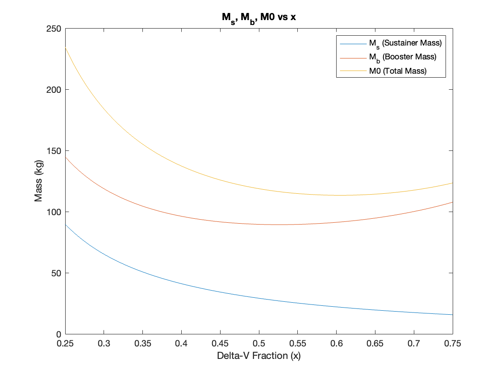
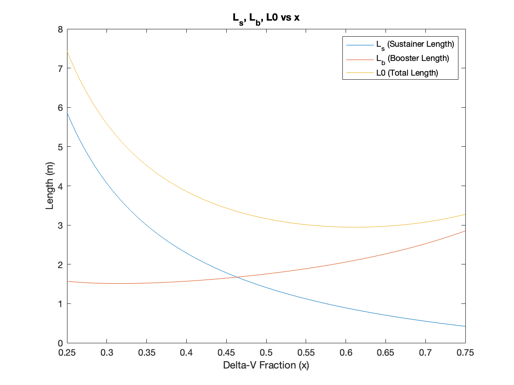

# Motor Casing Trade

The purpose of this is to see if we should do an aluminum or composite motor casing.

## How to use the code

Enter into main.m on matlab. Update the changable parameters. You can update the diameters of your stages as well as the material properties. Right now the properies are set to 6061 Aluminum. You can also update the altitude info.

Addtionally you can different parameters for the m_e (extra mass). This is the mass of things on the rocket that are not propellant or the casing.

Lastly you can either calculate the minimized thickness for a given motor casing. Right now it is set to .25" for the aluminum casing that we would have.

## Example Output

Here is the basic sizing for a rocket that will go to 100 km (assuming the delta-V is correct). This is using a 6in booster, 4in sustainer, aluminum and .25" thick motor casings. Additionally, there is 10kg of extra weight on each stage.

Please note that the length graph is not the stage length but the motor casing lenght. The rocket (and each stage) will generally be ~20-40% longer.

